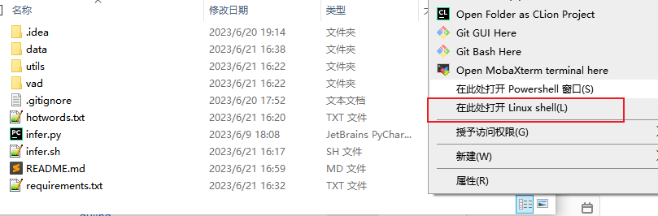
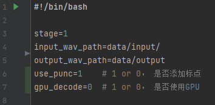

# vad_asr

## 使用说明

### 0. 环境搭建
如果是linux平台，先创建一个python环境，运行
```shell
git clone http://git.xmov.ai/dujing/vad-asr.git
cd vad-asr
pip install -r requirements.txt -i https://pypi.tuna.tsinghua.edu.cn/simple
```

如果是windows平台，可以先点击 https://git.xmov.ai/dujing/vad-asr/-/releases 下载最新版压缩包，直接解压后进入到压缩包文件夹，键盘shift+鼠标右键，打开linux shell(需要先安装wsl(https://learn.microsoft.com/zh-cn/windows/wsl/install))



然后创建一个python环境，运行
```shell
pip install -r requirements.txt -i https://pypi.tuna.tsinghua.edu.cn/simple
```

### 1. 数据准备
创建data/input文件夹(默认输入音频路径)，将原始需要切分的长音频放置到此文件夹下

根据音频内容修改热词列表文件hotwords.txt，可以略微改善热词识别效果

### 2. 切句和解码
运行
```shell
./run_vad_asr.sh

```
即可进行切句和解码。



可根据需要修改run_vad_asr.sh的参数，默认是添加标点，不使用GPU解码。

其他高级参数需要到vad_cut(4asr).py和infer.sh(py)里面去修改。使用CPU时默认的最大线程数是32，使用GPU时解码的默认batch_size是64。

### 3. 输出数据
在data/output下可以得到切分后音频路径wav.scp，以及对应的转写结果asr.txt
